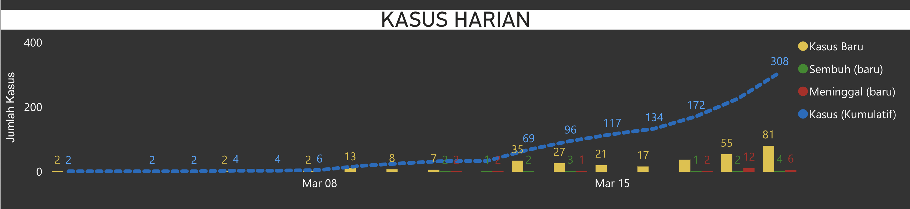

Awal tahun 2020 mungkin adalah salah satu tahun yg terberat bagi beberapa negara yang disebabkan oleh pandemi Corona (COVID-19).

Di Indonesia sendiri saat waktu saya menulis catatan (20 Maret 2020, 16:44 WIB) ini sudah ada total 308 kasus terkonfirmasi dan 25 orang meninggal (sumber: kawalcovid19.id).

Sebenernya ngeri juga kalau lihat angka rasio kematiannya sebesar 8.1%. Di kota tempat saya tinggal yaitu Kota Malang sendiri sudah mengeluarkan beberapa himbauan seperti meliburkan seluruh sekolah di Kota Malang terhitung mulai tanggal 16 Maret 2020. Selain itu kita juga dihimbau untuk tidak berpergian keluar rumah kecuali dalam kondisi darurat dan untuk para pekerja diharapkan untuk bekerja dari rumah.

Terus beberapa efek dari COVID-19 yang saya liat dan rasakan adalah :

- Jadi semakin aware sama kebersihan
- Drop-nya Index Harga Saham Gabungan (IHSG) yang otomatis bikin portofolio jadi berdarah-darah
- Rupiah melemah jadi 16.000, kalau ini antara berita buruk bagi negara tapi jadi berita baik buat saya (:
- Dari Senin sampai Jumat hari ini saya benar-benar work from home, biasanya dalam seminggu saya selingi bekerja ditempat ngopi biar tidak ngerasa jenuh dirumah
- Rencana saya ke Nepal bulan Agustus besok buat trekking di Annapurna Circuit bisa jadi batal, tapi masih liat kondisi di bulan-bulan sebelumnya

Sebentar lagi juga udah masuk bulan puasa, semoga semuanya selalu dilindungi dan selalu diberi kesehatan :)