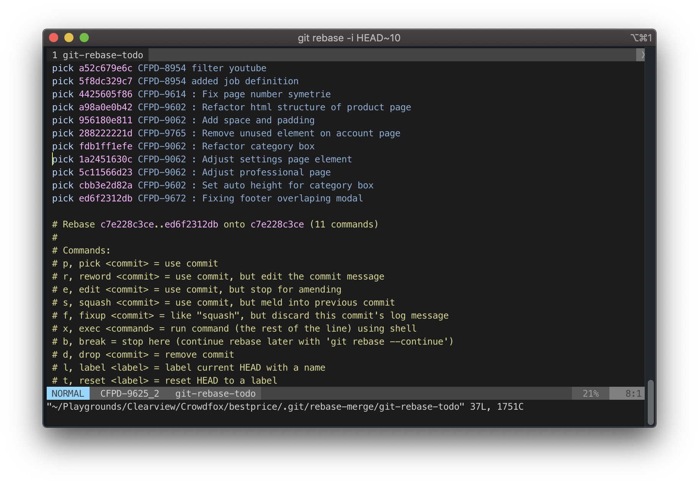
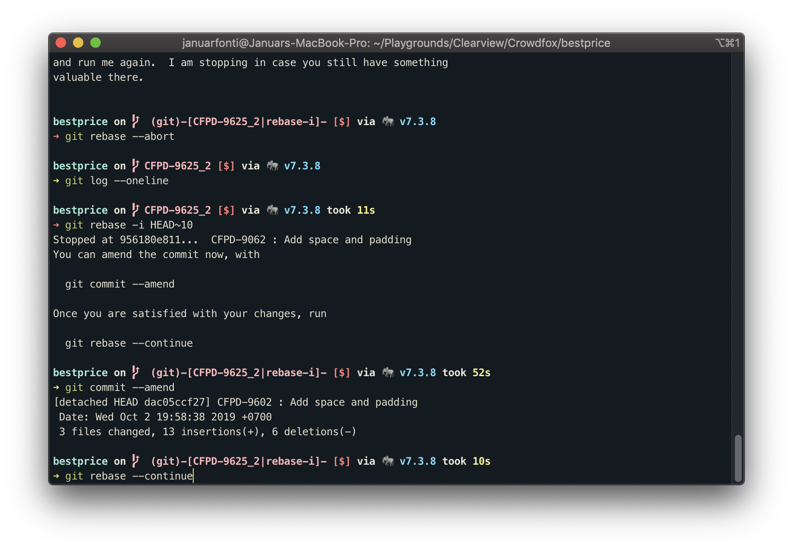

Pernahkah kamu ingin mengganti beberapa pesan commit yang telah kamu push ke repo ? Jadi gini contoh kasusnya, pada commit-an sebelumnya saya salah menulis nomor tiket CFPD-9062 yang seharusnya CFPD-9602.

Untuk menggantinya bisa menggunakan langkah-langkah dibawah ini, pertama buka daftar 10 commit-an terakhir kita. Angka 10 bisa diganti dengan berapapun.

```bash
git rebase -i HEAD~10
```



Cari baris commit-an yang akan dirubah, kemudian ganti pick dengan edit atau e sehingga menjadi seperti berikut

```bash
pick 5f8dc329c7 CFPD-8954 added job definition
pick 7b42167954 CFPD-9614 : Fix page number symetrie
e 06494d4aad CFPD-9062 : Refactor html structure of product page
e dac05ccf27 CFPD-9062 : Add space and padding
```

Simpan dan keluar dari vim dengan cara `:wq`. Lanjutkan dengan perintah amend untuk mengganti pesan commit satu persatu.

```bash
git commit --amend
```



Jika sudah diganti simpan dan keluar dari vim lalu dilanjutkan dengan

```bash
git rebase --continue
```

Jika kamu ingin mengganti lebih dari 1 commit tinggal ulangi perintah `git commit --amend` dan `git rebase --continue` sampai selesai.

Untuk melakukan push ke repo, kita perlu menambahkan perintah force pada git.

```bash
git push --force origin <nama-branch>
```